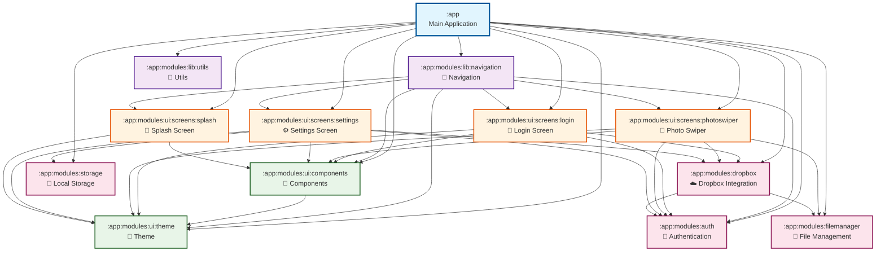

# Photo Categorizer - Module Structure

This document provides a comprehensive overview of the modular architecture for the Photo Categorizer application.

## Module Dependency Graph



## Module Layers

### 📱 Application Layer
```
:app (Main Application)
├── MainActivity.kt
└── App.kt
```
- **Purpose**: Application entry point and dependency injection setup
- **Dependencies**: All other modules

---

### 📚 Library Layer

#### 🔧 Utils Module (`:app:modules:lib:utils`)
```
lib/utils/
└── src/main/java/com/duchastel/simon/photocategorizer/utils/
    └── Extensions.kt
```
- **Purpose**: Common utility functions and Kotlin extensions
- **Dependencies**: None (base module)

#### 📍 Navigation Module (`:app:modules:lib:navigation`)
```
lib/navigation/
└── src/main/java/com/duchastel/simon/photocategorizer/navigation/
    ├── AppNavigation.kt
    ├── SignedInWrapper.kt
    └── SignedOutWrapper.kt
```
- **Purpose**: Core navigation logic and route management
- **Dependencies**: UI Theme, UI Components, All Screen modules, Auth

---

### 🎨 UI Foundation Layer

#### 🎨 Theme Module (`:app:modules:ui:theme`)
```
ui/theme/
└── src/main/java/com/duchastel/simon/photocategorizer/ui/theme/
    ├── Color.kt
    ├── Theme.kt
    └── Type.kt
```
- **Purpose**: Material Design 3 theme configuration
- **Dependencies**: None (base UI module)

#### 🧩 Components Module (`:app:modules:ui:components`)
```
ui/components/
└── src/main/java/com/duchastel/simon/photocategorizer/ui/components/
    ├── HorizontalSwiper.kt
    ├── OneWayVerticalSwiper.kt
    ├── Shimmer.kt
    ├── SkeletonLoader.kt
    └── SwipeDirection.kt
```
- **Purpose**: Reusable UI components library
- **Dependencies**: UI Theme

---

### 📱 Screen Layer

#### 🔐 Login Screen (`:app:modules:ui:screens:login`)
```
ui/screens/login/
└── src/main/java/com/duchastel/simon/photocategorizer/screens/login/
    ├── LoginScreen.kt
    └── LoginViewModel.kt
```
- **Purpose**: User authentication interface
- **Dependencies**: UI Theme, UI Components, Auth, Dropbox

#### 📸 Photo Swiper Screen (`:app:modules:ui:screens:photoswiper`)
```
ui/screens/photoswiper/
└── src/main/java/com/duchastel/simon/photocategorizer/screens/photoswiper/
    ├── PhotoSwiperScreen.kt
    ├── PhotoSwiperViewModel.kt
    └── SwipeDirection.kt
```
- **Purpose**: Main photo categorization interface with swipe gestures
- **Dependencies**: UI Theme, UI Components, Auth, Dropbox, File Manager

#### ⚙️ Settings Screen (`:app:modules:ui:screens:settings`)
```
ui/screens/settings/
└── src/main/java/com/duchastel/simon/photocategorizer/screens/settings/
    ├── SettingsScreen.kt
    └── SettingsViewModel.kt
```
- **Purpose**: App configuration and user preferences
- **Dependencies**: UI Theme, UI Components, Auth, Dropbox, Storage

#### 💫 Splash Screen (`:app:modules:ui:screens:splash`)
```
ui/screens/splash/
└── src/main/java/com/duchastel/simon/photocategorizer/screens/splash/
    └── SplashScreen.kt
```
- **Purpose**: App startup and initialization screen
- **Dependencies**: UI Theme, UI Components

---

### ⚙️ Business Logic Layer

#### 🔑 Auth Module (`:app:modules:auth`)
```
auth/
└── src/main/java/com/duchastel/simon/photocategorizer/auth/
    ├── AuthRepository.kt
    ├── AccessTokenAuthInterceptor.kt
    └── LoggedOutInterceptor.kt
```
- **Purpose**: Core authentication interfaces and logic
- **Dependencies**: None (base business module)

#### ☁️ Dropbox Module (`:app:modules:dropbox`)
```
dropbox/
├── src/main/java/com/duchastel/simon/photocategorizer/dropbox/
│   ├── auth/
│   │   └── DropboxAuthRepository.kt
│   ├── di/
│   │   ├── AuthModule.kt
│   │   ├── DropboxQualifier.kt
│   │   ├── FileManagerModule.kt
│   │   └── NetworkModule.kt
│   ├── files/
│   │   └── DropboxPhotoRepository.kt
│   └── network/
│       ├── Config.kt
│       ├── DropboxFileApi.kt
│       └── Models.kt
```
- **Purpose**: Complete Dropbox API integration
- **Dependencies**: Auth, File Manager

#### 📁 File Manager Module (`:app:modules:filemanager`)
```
filemanager/
└── src/main/java/com/duchastel/simon/photocategorizer/filemanager/
    └── PhotoRepository.kt
```
- **Purpose**: Abstract file management interface
- **Dependencies**: None (base business module)

#### 💾 Storage Module (`:app:modules:storage`)
```
storage/
└── src/main/java/com/duchastel/simon/photocategorizer/storage/
    ├── LocalStorageRepository.kt
    ├── SharedPrefsLocalStorageRepository.kt
    └── di/
        └── StorageModule.kt
```
- **Purpose**: Local storage management for app data
- **Dependencies**: None (base business module)

---

## Dependency Flow

### Layered Architecture
```
┌─────────────────────────────────────┐
│           :app (Main App)           │ ← Application Entry Point
├─────────────────────────────────────┤
│          Screen Modules             │ ← UI Screen Layer
│  🔐 Login  📸 PhotoSwiper  ⚙️ Settings │
│         💫 Splash                   │
├─────────────────────────────────────┤
│          UI Foundation              │ ← Base UI Components
│      🎨 Theme    🧩 Components      │
├─────────────────────────────────────┤
│         Library Utilities           │ ← Shared Utilities
│    📍 Navigation    🔧 Utils        │
├─────────────────────────────────────┤
│        Business Logic              │ ← Core Business Logic
│ 🔑 Auth  ☁️ Dropbox  📁 FileManager │
│            💾 Storage               │
└─────────────────────────────────────┘
```

### Key Principles

1. **Dependency Direction**: Dependencies flow upward - lower layers don't depend on higher layers
2. **Single Responsibility**: Each module has a clear, focused purpose
3. **Loose Coupling**: Modules interact through well-defined interfaces
4. **High Cohesion**: Related functionality is grouped together
5. **Scalability**: Easy to add new features by creating new modules

### Module Categories

| Category | Modules | Purpose |
|----------|---------|---------|
| **Application** | `:app` | Main app entry point and DI setup |
| **Library** | `lib:navigation`, `lib:utils` | Shared utilities and navigation |
| **UI Foundation** | `ui:theme`, `ui:components` | Base UI building blocks |
| **UI Screens** | `ui:screens:*` | Feature-specific UI implementations |
| **Business Logic** | `auth`, `dropbox`, `filemanager`, `storage` | Core business functionality |

---

## Benefits of This Architecture

### ✅ **Maintainability**
- Clear separation of concerns
- Easy to locate and modify specific functionality
- Reduced blast radius of changes

### ✅ **Scalability**  
- Simple to add new features as modules
- Independent module development
- Parallel team development possible

### ✅ **Testability**
- Modules can be tested in isolation
- Easy to mock dependencies
- Clear interfaces for testing

### ✅ **Build Performance**
- Incremental compilation
- Only changed modules rebuild
- Parallel module compilation

### ✅ **Code Reusability**
- Shared components and utilities
- Business logic reuse across features
- Clean abstraction layers

---

*Generated with [Claude Code](https://claude.ai/code)*